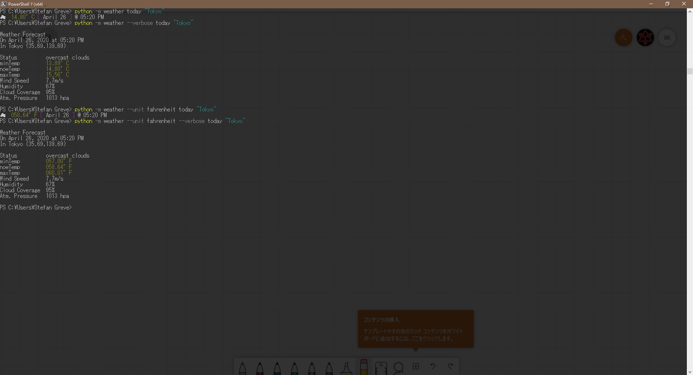

# Weather

This is a terminal application to browse today's weather using
[Open Weather API](https://openweathermap.org). Although the application
works there's still some fine-tuning to be done. As of April 23, 2020, the Development Status entered `3 - Alpha`.

## Installation

```bash
# enter project root, check wheel installation
python -m pip install --user wheel
# build wheel and install weather
python setup.py bdist_wheel
python -m pip install --user -r requirements.txt
```

## Basic Usage

```bash
# view help page
python -m weather --help

# print weather for Tokyo
python -m weather today "Tokyo"

# print detailed weather information
python -m weather --verbose today "Tokyo"

# change displayed temperature units
python -m weather --unit fahrenheit today "Tokyo"
```



---

## Notes

Add `forecast` function to script, e.g.

```python
# Query for 3 hours weather forecast for the next 5 days over toponym
forecast = owm.three_hours_forecast(toponym).get_forecast()
weathers = forecast.get_weathers()
for weather in weathers:
    print(weather.get_status())
```

The free API limits forecasts to three hours into the future.

## TODO

Add customization:

- [ ] Set configuration in the terminal
- [X] Add more units for temperature results: `[ 'kelvin', 'fahrenheit', 'celsius' ]`.
- [X] Edit `color_temperature()` in `utils.py` for the other two units.
- [ ] Add `German` and `Japanese` as locals
- [ ] Add screenshot and documentation
- [ ] `utils.py` conflict with `timetravel` needs to be resolved; more
      tests are needed to get to the root of this problem
